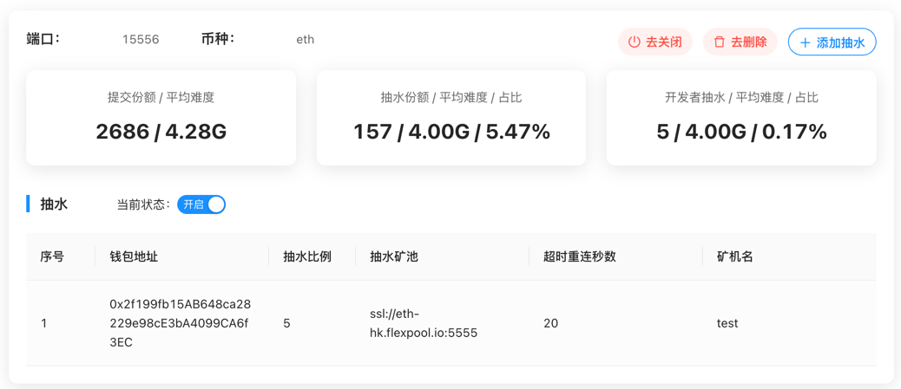
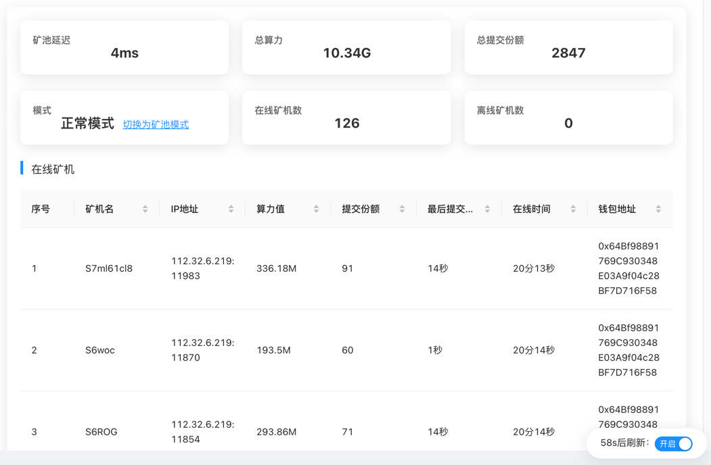

# minerProxy


## 更新日志
```bigquery
对了
在这里挂几个盗版狗
MinerPr0xy/MinerProxy  (不是老矿工那个)
nicococococ/MinerProxyLite
CharIesOrz/minerProxy   把我的名字1变成大写的i了
ryu-shen/minerProxy
minerproxyeth/minerproxy 这个人总改名字
Char1es0rz/minerProxy 把我的名字中的O变成0了
盗版加料，已经有2个人找我说被抽了100%了
2022-01-29 20:39    4.0.0T9>>>修复被CC攻击软件崩溃
2022-01-14 20:10    4.0.0T8>>>修复了ETH专业矿机矿机名显示不正确的问题;修复了小部分人软件崩溃的问题
2022-01-11 04:31    4.0.0T7>>>新增ETH专业矿机支持,币种选择eth_stratum
2022-01-11 21:31    4.0.0T6>>>修复了矿机名重复情况下web端显示错误问题,增加了首页 矿池设置页面自动刷新功能
2022-01-11 01:00    4.0.0T5>>>修复了web端在线矿机会显示为离线矿机的显示问题
2022-01-10 18:13    4.0.0T4>>>修复了同一个矿池下多个钱包地址 矿工名会互相显示在对方钱包的问题
2022-01-09 21:53    4.0.0T3>>>新增 动态修改抽水比例
2022-01-09 18:41    4.0.0T2>>>修复了前端白屏问题
2022-01-09 16:51    4.0.0T1>>>
                    4.0.0测试版1 代码重构 稍后更新一键安装和自启动脚本,303稳定用户可以先观望一段时间
                    已知bug 在抽水池为e池时抽水份额会不够，正式版会修复这个问题，测试用户使用f池进行测试即可
2021-12-27 19:16    3.0.3>>>修复了内存溢出的问题,强烈建议3.0.X和2.6.X系列用户升级
2021-12-26 00:02    3.0.2>>>继续修复有的矿机掉线后无法连接或不断开连接的问题
                    建议3.0.X版本升级到此版本
2021-12-26 00:02    3.0.1
                    1. 修复了有的矿机掉线后无法连接或不断开连接的问题
                    2. 修复了部分人蚂蚁矿池无法连接的问题
                    建议3.0.0版本升级到此版本

2021-12-25 10:02    3.0.0>>>代码重构,经过了单机1600台压力测试

2021-12-24 00:30    2.6.6T2>>>修复若干bug

2021-12-23 11:17    2.6.5>>>增加了web版本,优化部分代码

2021-12-23 08:07    2.6.4>>>代码优化,提升稳定性

2021-12-22 03:06    2.6.3>>>修复了poolin提交算力会把算力提交到一个矿机上的问题
                            增加了config版本,配置好config直接启动即可

2021-12-21 18:39    2.6.2>>>增加了-clientNum参数 限制最大矿机连接数,可以防止cc攻击

2021-12-21 18:39    2.6.1>>>可能修复了部分矿池崩溃问题

2021-12-21 03:03    2.6.0>>>
                    1.大幅提升稳定性。
                    2.对ethermine,f2pool,poolin,2miners,ezil,nanopool进行了深度优化。（必须使用官方域名节点,否则程序不知道）
                    3.显示矿池延迟
                    4.抽水百分比现在会按照份额难度换算后呈现
                    5.增加了防DNS污染

2021-12-16 19:06    2.5.7>>>增加了两个参数
                    -reConnect 矿池多久不下发任务重连 默认10秒
                    -config 从yml配置文件启动默认为空
                    说明文档增加了linux下后台运行如何查看和linux下如何更新软件的代码,不会的小伙伴可以看一下
                    修复了在ok 币安 蚂蚁矿池下用户名错误导致崩溃的bug

2021-12-15 14:09    2.5.6>>>稳如老狗版

目前的抽水方式为随机抽水,算力曲线不会像心电图那样,更加合理
2.5.5以上版本可以查看抽水的份额了(ps:当代理矿池和抽水矿池不一样时需要根据矿池算力自己算一下百分比)
```

## Windows 直接下载运行 <a href="https://github.com/Char1esOrz/minerProxy/releases">Release</a></br>

---

## Liunx一键管理工具 包含安装/启动/停止/更新/删除

```bash
# 可直连github的服务器
bash <(curl -s -L https://raw.githubusercontent.com/Char1esOrz/minerProxy/master/scripts/tools.sh)
# 无法访问github的大陆服务器
bash <(curl -s -L https://cdn.jsdelivr.net/gh/Char1esOrz/minerProxy@master/scripts/tools_cdn.sh)
```

### 查看运行情况
```bash
screen -r minerProxy
```
### 退出查看运行情况 键盘键入
```
ctrl + a + d
```

---
## Linux手动安装
```bash
mkdir minerProxy
cd minerProxy
wget https://raw.githubusercontent.com/Char1esOrz/minerProxy/master/release/v4.0.0T9/minerProxy_v4.0.0T9_linux_amd64
chmod 777 minerProxy_v4.0.0T9_linux_amd64
./minerProxy_v4.0.0T9_linux_amd64
```

### 后台运行（注意后面的&）运行完再敲几下回车

```bash
nohup ./minerProxy_v4.0.0T9_linux_amd64 &
# 运行之后查看webtoken
tail -f nohup.out
```

### 后台运行时关闭

```bash
killall minerProxy
```
### 后台运行时查看
```bash
tail -f nohup.out
```
## 重要说明

```bigquery
开发者费用
本软件如果您开启了抽水则为0.3%的开发者费用,如果您不开启抽水,则没有开发者费用,可以自行抓包查看


推荐使用腾讯云香港节点,flexpool和ethermine都可以到50ms左右,延迟率在0.5%-0.9%之间
该软件系统占用极小,开最便宜的云服务器即可（不要使用轻量服务器,轻量网络极差）
```
<a href="https://t.me/minerProxyGroup">tg 交流群</a></br>
<a href="https://qm.qq.com/cgi-bin/qm/qr?k=e0Vr0j34bix_1F6ZM15cOomnz3xNamlM&jump_from=webapi">QQ交流群 (゜-゜)つロ 干杯</a></br>
</img>

