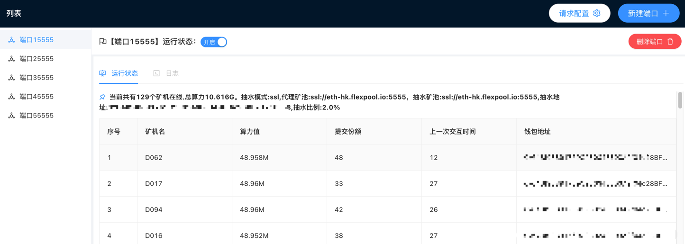

# minerProxy

## 更新日志
2.5.5可以查看抽水的份额了


```bigquery
2021-12-15 14:09    2.5.6>>>稳如老狗版
```

## Liunx下

```bash
git clone https://github.com/Char1esOrz/minerProxy.git
cd minerProxy 
./minerProxy -pool ssl://eth-hk.flexpool.io:5555 -port 15555
```

## 提示bash: git: command not found的先安装git

```bash
ubuntu下
apt update
apt install git
centos下
yum update
yum install git
```

### 后台运行（注意后面的&）运行完再敲几下回车

```bash
nohup ./minerProxy -pool ssl://eth-hk.flexpool.io:5555 -port 15555 &
```

### 后台运行时关闭

```bash
killall minerProxy
```

### 要运行多个代理矿池,设置不同的本地端口即可,例如

```bash
nohup ./minerProxy -pool ssl://asia2.ethermine.io:5555 -port 18888 &
```

## Windows-CMD下

```bash
minerProxy.exe -pool ssl://eth-hk.flexpool.io:5555 -port 15555
```

---

# 参数说明


## 例子

### 往0x101ef3daC50318dDE0237760A5dbc0E27d8fA5dE钱包地址抽水0.5%

```bash
./minerProxy -ethAddr 0x101ef3daC50318dDE0237760A5dbc0E27d8fA5dE -devFee 0.5
```

# 连接tcp矿池

```bash
./minerProxy -pool tcp://eth-hk.flexpool.io:4444
```

## 重要说明

```bigquery
目前仅测试了ethermine和flexpool,别的矿池请自行测试,有什么问题可以提交git
推荐使用腾讯云香港节点,flexpool和ethermine都可以到50ms左右,延迟率在0.5%-0.9%之间
该软件系统占用极小,开最便宜的云服务器即可
可接定制软件
tg交流群
https://t.me/minerProxyGroup
```


