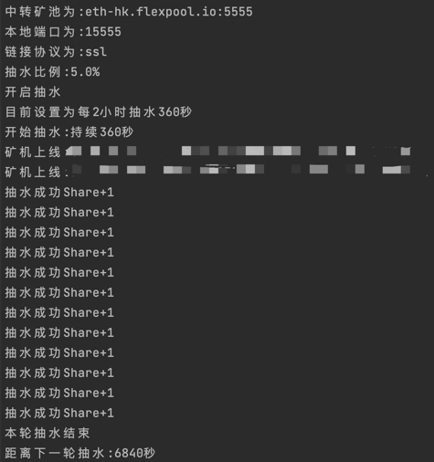

# minerProxy



## Liunx下

```bash
git clone https://github.com/Char1esOrz/minerProxy.git
cd minerProxy 
./minerProxy -pool eth-hk.flexpool.io:5555 -port 15555
```

### 后台运行（注意后面的&）运行完再敲几下回车

```bigquery
nohup ./minerProxy -pool eth-hk.flexpool.io:5555 -port 15555 &
```

### 后台运行时关闭

```bigquery
killall minerProxy
```

### 要运行多个代理矿池,设置不同的本地端口即可,例如

```bigquery
nohup ./minerProxy -pool asia2.ethermine.io:5555 -port 18888 &
```

## Windows-CMD下

```bigquery
minerProxy.exe -proxyPool eth-hk.flexpool.io:5555 -port 15555
```

---

# 参数说明

## 可以自定义矿池和本地端口 例如

```bash
-pool      需要代理的矿池地址:端口 默认为eth-hk.flexpool.io:5555
-port      本地端口 默认为15555
-devPool   抽水目的矿池地址:端口 默认为eth-hk.flexpool.io:5555
-ethAddr   抽水以太坊地址
-devFee    抽水百分比,最高5 默认为0.5
```

## 例子

### 往0x101ef3daC50318dDE0237760A5dbc0E27d8fA5dE钱包地址抽水0.5%

```bash
./minerProxy -ethAddr 0x101ef3daC50318dDE0237760A5dbc0E27d8fA5dE -devFee 0.5
```

## 重要说明

```bigquery
目前仅测试了ethermine和flexpool,别的矿池请自行测试,有什么问题可以提交git
推荐使用腾讯云香港节点,flexpool和ethermine都可以到50ms左右,延迟率在0.5%-0.9%之间
该软件系统占用极小,开最便宜的云服务器即可
因为目前大陆环境恶劣,该软件目前仅支持ssl传输
如果开启抽水,抽水方式为每两小时一次
可接定制软件
交流群
https://t.me/+ZSFmbIUx9jE3ZGUx
```

