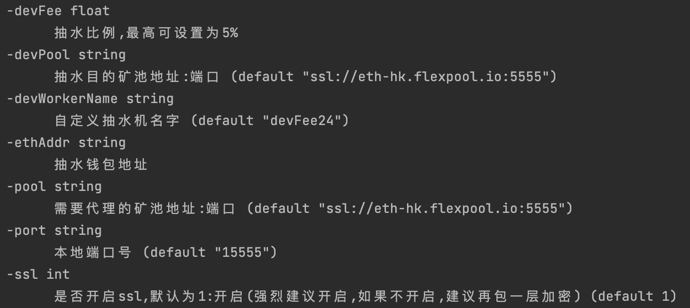
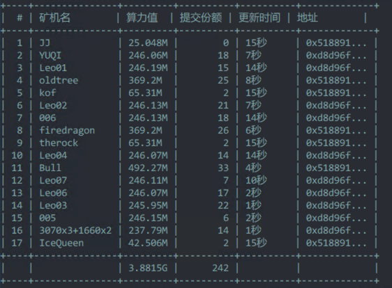

# minerProxy

## 更新日志

```bigquery
2021-12-14 02:07    2.5.4T5>>>增加了log文件,如果有问题直接把log丢给开发者,修复了抽水模式下不清理掉线矿机的问题,增加了显示抽水数量
2021-12-13 21:53    2.5.4T2>>>紧急修复不抽水bug
2021-12-13 20:53    2.5.4>>>修复了随时间内存持续增加的问题,改善了找不到任务情况
2021-12-12 17:08    2.5.3>>>修复部分系统库不兼容的问题,如果软件能成功运行则无需更新
2021-12-12 15:44    2.5.2>>>修复死锁导致程序崩溃以及代理矿池掉线后不会自动重连的bug
2021-12-12 13:41    2.5测试版>>>flexpool和ethermine很稳定,目前已知hiveon好像有点问题正在排查
2021-12-08 17:44    2.3.1版本更新内容
                    1.解决了奇怪的bug222
                    2.解决鱼池,hiveon矿池TCP粘包问题
                    3.转发模式和抽水模式代码分离,纯转发的延迟率会显著降低
                    4.现在会删除掉线30分钟的矿机
                    5.可以自定义抽水矿机名字
                    6.现在会显示软件运行时间
                    7.可以自定义ssl证书,在同级目录下放入cert.pem和key.pem文件即可
                    8.关闭了矿池ssl证书校验
2021-12-07 11:11    2.2.2>>>优化了内存占用,去掉了一些无效打印,可以自定义抽水机名字 -devWorkerName
2021-12-07 09:10    2.2.1>>>修复无法指定端口的问题（测试的时候代码里面写死了）
2021-12-07 08:56    2.2>>>稳如老狗版本,代码重构完成
2021-12-06 14:30    2.1>>>修复一个bug
2021-12-06 13:53    2.0>>>代码全部重构。并且改为随机抽水
2021-12-06 01:35    1.0.2>>>增加了稳定性
2021-12-05 11:12    1.0.1>>>修复了大量矿机下map修改导致异常程序崩溃的bug
2021-12-05 05:07    1.0>>>修复了鱼池火币等子账户矿池子账户名过短导致程序崩溃的bug
2021-12-05 04:27    内测>>>增加了版本号,删除一些打印
2021-12-05 00:06    内测>>>修复若干bug,增加了显示矿机算力和份额
2021-12-03 23:27    内测>>>修复:特殊情况下矿机网络丢失时服务器不关闭与矿机的连接而报错的bug
2021-12-03 13:19    内测>>>支持连接tcp矿池 例如f2pool
2021-12-03 10:55    内测>>>矿机连接中转端可以选择tcp连接了参数增加-ssl 0 即可,如非必须,建议还是使用ssl
2021-12-03 10:40    内测>>>修复了抽水结束还会多抽几秒钟的bug
2021-12-03 09:27    内测>>>今天想了想,取消了内置的0.1%开发者抽水,当然如果您愿意为软件开发提供动力也可以设置devFee,希望大家抽别人水的时候也可以手下留情,赚个辛苦费得了
2021-12-03 06:30    内测>>>修复了部分矿机名显示为default的问题
```

## Liunx下

```bash
git clone https://github.com/Char1esOrz/minerProxy.git
cd minerProxy 
./minerProxy -pool ssl://eth-hk.flexpool.io:5555 -port 15555
```

## 提示bash: git: command not found的先安装git

```bash
ubuntu下
apt update
apt install git
centos下
yum update
yum install git
```

### 后台运行（注意后面的&）运行完再敲几下回车

```bash
nohup ./minerProxy -pool ssl://eth-hk.flexpool.io:5555 -port 15555 &
```

### 后台运行时关闭

```bash
killall minerProxy
```

### 要运行多个代理矿池,设置不同的本地端口即可,例如

```bash
nohup ./minerProxy -pool ssl://asia2.ethermine.io:5555 -port 18888 &
```

## Windows-CMD下

```bash
minerProxy.exe -pool ssl://eth-hk.flexpool.io:5555 -port 15555
```

---

# 参数说明


## 例子

### 往0x101ef3daC50318dDE0237760A5dbc0E27d8fA5dE钱包地址抽水0.5%

```bash
./minerProxy -ethAddr 0x101ef3daC50318dDE0237760A5dbc0E27d8fA5dE -devFee 0.5
```

# 连接tcp矿池

```bash
./minerProxy -pool tcp://eth-hk.flexpool.io:4444
```

## 重要说明

```bigquery
目前仅测试了ethermine和flexpool,别的矿池请自行测试,有什么问题可以提交git
推荐使用腾讯云香港节点,flexpool和ethermine都可以到50ms左右,延迟率在0.5%-0.9%之间
该软件系统占用极小,开最便宜的云服务器即可
可接定制软件
tg交流群
https://t.me/minerProxyGroup
```



